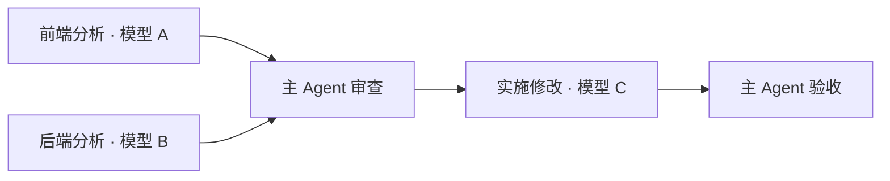

# qywork

**多模型接入、多 Agent 协作的轻量化开源 Agent Harness。**

Agent = Model + Harness。模型负责推理，qywork 提供工具执行、上下文管理、记忆、技能与任务编排，
并将它们集成进本地工作台。可以直接用于编程，也可以组合领域知识、工具和角色，定制自己的 Agent。

[下载 Windows / macOS / Linux 版](https://github.com/qingxueyanshang/qywork-qingyan-harness/releases/latest) ·
[快速开始](#快速开始) · [从源码启动](#从源码启动) · [文档](docs/INDEX.md)


## 核心特色

### 多模型接入，自由组合模型与服务

- 支持 **Anthropic Messages、OpenAI Chat Completions、OpenAI Responses** 三类接口，可接入官方服务、中转站和兼容协议的本地模型服务。
- 同时配置多个服务与模型，在会话中切换；支持自定义模型 ID，不受内置模型目录限制。
- 按模型能力选择思考档位，查看上下文容量、价格与实际用量；支持检测当前端点的思考参数。
- 主 Agent 与子 Agent 可以使用不同的模型，同一张任务图可以跨模型、跨服务分工。

常规接入在系统设置中完成，特殊端点配置见[模型接入](docs/models.md)。

### 提示词缓存复用，近期实测平均命中率 90%+

**本机最近 7 天实测：逐请求平均缓存命中率 90.88%，按输入 token 加权为 94.68%。**[^cache]

系统提示与已提交的对话前缀保持稳定，连续工作时复用服务商的提示词缓存。
项目状态、技能和记忆索引按轮次追加，避免每轮改写前缀。缓存命中量与费用直接显示在工作台中。

[^cache]: 2026-09-11 统计：最近 7 天本机 1,185 次回报缓存用量且输入总量大于零的模型请求。单次命中率 = 缓存读取 token ÷（未命中输入 + 缓存读取 + 缓存写入 token）；未回报缓存字段的请求不计入样本。属于实际使用样本，不是全历史均值或跨服务商保证；效果取决于端点缓存支持、前缀稳定性与任务连续性。

### 多 Agent 协作，不同模型组成 Graph

**任务可以并行分工，也可以按依赖组成有向无环图（DAG）。**

- **独立上下文**：每个内置子 Agent 有自己的会话，过程不全部挤进主会话；后续任务可沿用同一个子 Agent 的上下文。
- **跨模型分工**：分别指定分析、实现、复核所用的模型与服务，也可以复用预先配置的角色。
- **异步执行**：派发后主会话无需阻塞等待；节点完成或失败时自动送回结果，互不依赖的节点按并发上限同时运行。
- **检查点审查**：主 Agent 验收上一批结果，再批准下一批；需要返工时，向指定节点的原会话续发修订要求。
- **可视化跟进**：会话中展示 Graph 的依赖、节点状态与检查点，点开内置子 Agent 可查看执行过程。

例如，让两个模型并行分析前后端，再交给另一个模型实施：



Graph 由 Agent 根据任务生成，不需要事先写固定流程。临时子 Agent、配置角色和本机已接入的
外部 Agent CLI 可以混合编排；外部 CLI 使用它自己的模型与账号。详见[协作文档](docs/team.md)。

### 模块化 Harness，按业务组合能力

模型、执行循环、工具、上下文、存储和界面分层。领域定制通过模型配置、知识与工具扩展完成，
复用同一套任务执行和记录机制。

| 模块 | 能力 |
|---|---|
| **Skills** | 保存可复用的操作步骤与领域方法；支持项目和全局作用域，正文按需读取 |
| **Memory** | 保存项目约定、用户偏好与任务结论；支持项目和全局作用域、检索与迁移 |
| **MCP** | 接入外部工具与资源，在设置中管理项目或全局服务 |
| **Plugins** | 通过独立进程提供自定义工具，声明所需宿主能力 |
| **Agent Team** | 配置角色提示词、模型、思考档位和工具范围，供单个子任务或 Graph 使用 |

这些模块有对应的设置与管理入口，不必只靠编辑配置文件。
例如，组合行业技能、项目记忆、业务系统 MCP 和审查角色，可在同一个工作台中运行领域任务。
接入方式见[扩展文档](docs/INDEX.md#扩展能力)。

### 轻量交付，小系统提示词

- **约 30 MiB 的 Windows x64 安装包**：2026-09-11 发布包实测，包含 Bun 编译的执行内核；Tauri 2 桌面外壳使用系统 WebView。
- **安装即可运行**：桌面版无需用户另装 Bun、Rust 或部署后端。
- **基础系统提示正文 1,120 字符**，启用全部内置能力说明后为 **2,468 字符**：2026-09-11 [源码测量](packages/runtime/src/prompt.ts)，不包含工具参数、角色提示和会话上下文。
- **按需装配上下文**：Skills、Memory 先提供索引，再读取正文；外部工具说明超过预算时转为按需加载。

### 工作台覆盖执行、协作与产出检查

| 工作区域 | 已支持的操作 |
|---|---|
| 项目与会话 | 管理多个工作区与会话，切换模型，查看历史记录 |
| 会话流 | 查看思考、工具调用、待办进度、子 Agent 与 Graph 状态 |
| 文件与变更 | 浏览文件树，查看和编辑源码，检查文件差异 |
| 浏览器与终端 | 多标签浏览器预览、桌面端交互式终端，可与任务并排查看 |
| 产出预览 | 查看图片、PDF、音视频以及文本文件 |
| 运行与用量 | 查看逐次模型请求、token、缓存、费用和停止原因；汇总内置子 Agent 用量 |

支持明暗主题、可调整侧栏与多标签面板。流式回复采用增量 Markdown 渲染，
复用已定稿内容；代码编辑器、终端和子会话等面板按需加载。

### 长任务管理：上下文、目标与定时任务

- **上下文压缩**：长输出先收纳为可按需读取的资源，长会话再生成摘要；原始消息与工具结果保留，可回查历史。
- **目标与待办**：待办跟进具体步骤；用户设定目标后可跨轮次继续推进，直至完成、受阻或由用户停止。
- **定时任务**：为项目设置重复执行的任务，支持暂停、修改和立即运行；仅在应用运行时触发。
- **执行记录**：刷新或重连后仍可查看已落盘的步骤、工具结果与文件变化，并导出会话或诊断信息。

### 本地数据，同一服务多端访问

无需注册 qywork 账号，配置、会话、记忆与用量保存在本机。模型请求发往你配置的服务，
不提供 qywork 云同步，也不采集产品遥测。

桌面和浏览器共用同一内核；主动开启局域网访问后，手机也可连接本机服务。
交互式终端仅在桌面端提供。

运行日志在 `~/.qywork/logs/`（设置了 `QYWORK_HOME` 时以它为根）：`qy.log` 是服务端，
`qywork.log` 是桌面壳，各超过 5 MB 时改名为 `.1` 保留一份。连接开合、握手结果、
服务端退出与桌面壳重新拉起它的记录都在这里。

## 快速开始

1. 从 [GitHub Releases](https://github.com/qingxueyanshang/qywork-qingyan-harness/releases/latest) 下载对应系统与架构的安装包：Windows x64 `.exe`、macOS Intel / Apple Silicon `.dmg`、Linux x64 `.deb` 或 `.AppImage`。
2. 打开“系统设置”，添加模型服务，填写接口地址、API Key 和模型名称。
3. 点击“新建 work”，选择项目目录，输入任务。

关闭窗口会收进系统托盘；完全退出使用托盘菜单中的“退出”。
安装包未做 Authenticode 签名，Windows 可能显示 SmartScreen 提示；
Release 中各平台的 `SHA256SUMS-*.txt` 可用于校验文件完整性。

## Linux 与 macOS

从 v0.1.19 起，Releases 同步提供 Linux x86_64 的 `.deb`、`.AppImage` 与 macOS Intel / Apple Silicon 的 `.dmg`，
均由[发布工作流](.github/workflows/)构建。应用内自动安装更新目前仅支持 Windows；macOS/Linux 下载新安装包更新。

- **deb**：依赖已写入包内（`at-spi2-core`，推荐 PipeWire 与 `xdg-desktop-portal`），
  `sudo apt install ./qywork_*.deb` 会一并安装。
- **AppImage**：系统需已安装 `fuse3`、`libegl1`、`libgles2` 与 `at-spi2-core`；
  未安装 FUSE 时加 `--appimage-extract-and-run` 参数运行。
- **浏览器控制**：使用本机已安装的 Chrome、Edge 或 Chromium，安装包不附带浏览器。
- **电脑控制（macOS）**：需在系统设置中授予“辅助功能”权限，截图另需“屏幕录制”权限。
- **macOS 签名**：当前未做 Apple Developer ID 签名和公证，Gatekeeper 可能阻止直接打开；更新包签名不替代 Apple 代码签名。

## 从源码启动

安装 [Bun](https://bun.sh) 1.4.2 或更新版本后克隆仓库：

```powershell
git clone https://github.com/qingxueyanshang/qywork-qingyan-harness.git
cd qywork-qingyan-harness
```

启动浏览器界面：

```powershell
.\start.bat web
```

启动原生桌面窗口还需 [Rust](https://rustup.rs/) 与 Tauri 的系统构建依赖：

```powershell
.\start.bat
```

脚本首次启动会安装 JavaScript 依赖。

## 使用边界

- Agent 可以修改文件和运行命令，权限模式与平台沙箱边界见[权限说明](docs/permissions.md)。
- Word、PPT、Excel 专用面板、无限画布和插件自定义预览器尚未接入，不属于当前已交付能力。

## 文档与许可

[文档索引](docs/INDEX.md) · [架构决策](ARCHITECTURE.md) · [模型接入](docs/models.md) ·
[MCP](docs/mcp.md) · [插件](docs/plugins.md) · [子 Agent 与 Graph](docs/team.md)

采用 [Apache License 2.0](LICENSE)，第三方依赖许可证见
[THIRD_PARTY_NOTICES.md](THIRD_PARTY_NOTICES.md)。
