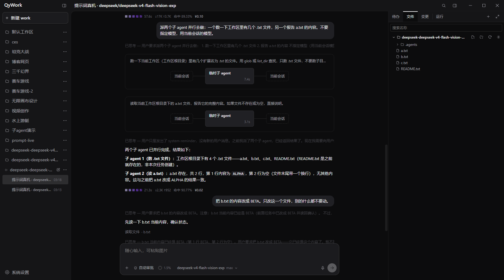

# qywork

## 本地运行、模块化、可扩展的 Agent Harness

qywork 是一个面向真实软件工程任务的开源 Agent Harness（执行框架）。它把模型适配、
系统提示词、上下文管理、工具调用、权限控制、过程持久化和工作台 UI 收敛到同一个本地内核，
让桌面端、命令行、手机端和自动化任务共享一致的执行语义。

它的核心价值，是让一个编码任务从“提出要求”到“修改代码、运行验证、保存结果”形成稳定、
可追踪、可恢复的闭环。



<p align="center"><sub>同一个工作台内查看并行子 Agent、流式会话、运行指标、文件与项目状态。</sub></p>

## 下载

Windows x64 安装包通过 [GitHub Releases](https://github.com/qingxueyanshang/qywork-qingyan-harness/releases)
提供。每个版本公开后，发布页会同时提供版本说明和 SHA-256 校验文件。

## 核心亮点

### Agent Harness 是产品内核

qywork 的 Harness 完整管理一次任务的生命周期：

- 将不同模型协议适配成统一请求与事件；
- 组装稳定的系统提示词、历史上下文和动态工作区信息；
- 驱动模型读取文件、修改代码、运行命令并根据结果继续判断；
- 管理权限边界、失败重试、上下文压缩与停止原因；
- 持久化会话、运行、步骤、工具结果、模型请求和用量；
- 将同一条事件流投影到桌面 UI、CLI、手机端和自动化接口。

模型、工具、界面和存储都围绕这条运行主线协作，不各自维护第二套任务状态。

### 清晰的模块化能力边界

仓库按稳定职责拆成独立 workspace：

| 层 | 模块 | 职责 |
|---|---|---|
| 领域与协议 | `core` | 业务对象、事件和跨端协议；自身没有运行时依赖 |
| 模型接入 | `ai` | Anthropic、OpenAI 兼容接口与 OpenAI Responses 适配 |
| 执行内核 | `runtime`、`agent` | 会话装配、提示词、上下文、Agent 循环与运行控制 |
| 工具边界 | `tools` | 文件、搜索、命令、网络工具及权限约束 |
| 本地账本 | `store` | SQLite 会话账本、运行步骤、用量与内容寻址存储 |
| 服务入口 | `server`、`cli` | 本地 API、WebSocket、命令行与运行生命周期 |
| 扩展系统 | `mcp`、`plugins`、`team` | 外部工具、插件进程和多 Agent 编排 |
| 产品界面 | `apps/web`、`apps/desktop` | Solid 工作台与 Tauri 桌面外壳 |

这套边界让模型协议、工具集、存储实现和产品界面可以独立演进，同时仍由一套事件协议连接。
桌面外壳不保存业务状态，WebView、手机浏览器和 CLI 最终看到的是同一本本地账本。

### 轻量化首先体现在模型上下文

qywork 把提示词、工具和扩展能力都按运行时成本设计，而不是把所有说明一次塞给模型：

- 能力全开时，固定系统提示词正文仍只有约 **1.5K 字符**，保守估算约 **1.4K tokens**；
- 固定提示词拆成 `system → environment → rules` 三层冻结前缀，跨运行保持逐字节稳定；
- 日期、工作区状态和待办清单放在动态尾区，不让易变内容击穿前面的长缓存；
- 技能与记忆只发送名称和摘要，需要时才读取正文；
- MCP 与插件工具先发送索引，需要调用时才加载完整 schema；
- 工具顺序、缓存断点和路由指纹保持稳定，缓存命中与写入用量进入本地账本；
- 长会话压缩只改变发送给模型的投影，原始消息和工具记录仍完整保留。

这套结构让新增技能、记忆和外部工具时，系统提示词不会跟着无限膨胀；长任务也不需要反复支付
整段历史和全部扩展说明的 token 成本。桌面运行层同样保持单内核：系统 WebView、自包含的
`qy` 二进制和按需加载的 UI 模块，共同避免为不同入口复制运行时与业务状态。

### 并行执行，同时保留完整任务轨迹

qywork 通过任务拆分、依赖编排和状态持久化提高真实任务的执行效率：

- `subagent` 将互不依赖的调查或实现任务放进同一波次并行执行；
- `workflow` 用依赖图表达有先后关系的步骤，并把上一步产出传给下一步；
- Agent Team 为不同角色绑定各自的模型、提示词和工具范围；
- 主会话只接收子任务结论，子任务的执行过程保留在独立会话中，避免挤占主上下文；
- 每个 Run、Step、工具动作和模型请求都有持久化状态，失败、重试、停止和恢复都有明确记录；
- WebSocket 断线后按事件位置补发，刷新界面不会把正在执行的任务变成一段失去状态的文本。

并行只用于真正互不依赖的任务；需要顺序与数据传递时交给 workflow。这样既缩短可并行部分的
墙钟时间，也不牺牲执行边界和可追溯性。

### 完整的 Agent 工作台

Web 工作台覆盖编码 Agent 的主要操作面：

- 多工作区、多会话和会话归档；
- 正文、思考、工具调用、待办、停止原因、上下文和用量的实时呈现；
- 文件树、代码预览、Git 变更与运行详情；
- 本地终端、内嵌浏览器、图片与文档附件；
- 模型、权限、用量、记忆、技能、MCP、插件、定时任务和 Agent Team 设置；
- 明暗主题、流式渲染、断线补发，以及主动开启后的手机局域网访问。

重功能通过动态模块加载，保持首屏轻量；所有面板读取同一条 Harness 运行记录，避免界面展示与
后台实际执行产生两套口径。

### 本地优先，边界透明

- qywork 不要求注册账号，不提供 qywork 云同步，也不采集产品遥测；
- 配置、会话、运行记录和用量账本保存在本机 `~/.qywork/`；
- API Key 保存在本机，模型请求发送到用户自己配置的服务商或本地模型端点；
- 桌面端默认连接本机服务，手机访问需要用户主动开启局域网监听并配对；
- Agent 可以修改文件和运行命令。原生 Windows 当前没有内核级命令沙箱，具体边界见
  [权限说明](docs/permissions.md)。

## 一项任务如何运行

```text
用户任务
   ↓
工作区 + 会话
   ↓
创建独立 Run
   ↓
组装模型、冻结前缀、历史、动态尾区和工具
   ↓
模型决定下一步 ──> 工具执行 ──> 结果落库
   ↑                                  │
   └──────────── 未完成则继续 ────────┘
   ↓
输出结果 + 保存步骤、状态、用量与停止原因
```

核心业务对象只有一条清晰的归属链：

```text
Workspace
└── Conversation
    └── Run
        ├── Step（正文 / 思考 / 工具动作）
        ├── Provider Request
        └── Usage
```

例如，用户要求“修复登录错误并补充测试”时，qywork 会在指定工作区读取相关代码，模型提出修改，
工具执行文件操作和测试命令，结果再返回模型继续判断。每一步同步进入事件流和本地账本，页面刷新、
连接恢复或切换入口后仍能回到同一项运行。

## 运行拓扑

```text
Tauri 桌面端 ── WebSocket ─┐
手机浏览器 ─── WebSocket ──┼──> qy serve ──┐
                                              ├──> Runtime / Agent Loop
qy exec 命令行 ───────────────────────────────┘          │
                                                         ├── 模型适配器 ──> 用户配置的模型服务
                                                         ├── 工具与权限 ──> 本地工作区
                                                         ├── 扩展注册表 ──> Skills / MCP / Plugins / Team
                                                         └── 持久化 ──────> SQLite 本地账本
```

`qy` 是产品内核。Tauri 负责桌面窗口、Sidecar 生命周期和本地终端；WebView 直接连接
`qy serve`；CLI 则复用相同的 Runtime。业务状态始终由本地内核维护，前端只负责展示和发出指令。

## 快速开始

从源码运行需要 [Bun](https://bun.sh)，具体版本以根目录 `package.json` 为准。

```bash
bun install
bun run packages/cli/src/index.ts init
bun run packages/cli/src/index.ts exec "阅读当前项目并说明它的核心结构"
```

启动桌面开发环境：

```bash
bun run tauri:dev
```

构建桌面安装包：

```bash
bun run tauri:build
```

## 延伸文档

- [架构决策](ARCHITECTURE.md)：关键设计、实测依据与不能破坏的不变量。
- [权限模型](docs/permissions.md)：工具权限、命令执行与平台沙箱边界。
- [MCP](docs/mcp.md)、[插件](docs/plugins.md)、[多 Agent 编排](docs/team.md)：扩展能力的配置与限制。

## 许可

Apache-2.0，见 [LICENSE](LICENSE)。第三方依赖许可证见
[THIRD_PARTY_NOTICES.md](THIRD_PARTY_NOTICES.md)。
